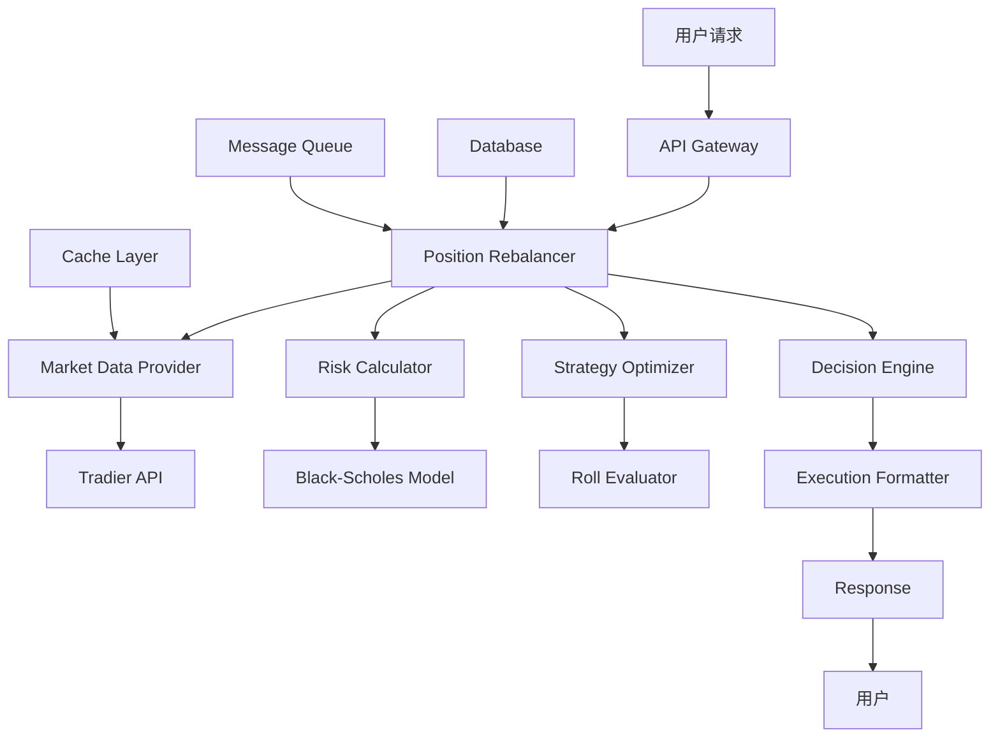

# PRD: Option Position Rebalancer - 期权仓位再平衡与风险管理引擎 MCP Server Prompt

## 1. Executive Summary

### 1.1 Product Vision
构建一个专业级的期权仓位再平衡与风险管理引擎MCP Server Prompt，为期权交易者提供实时的仓位监控、智能决策分析和防御性策略执行能力。系统将集成市场数据、风险计算、策略优化和执行建议，实现期权仓位的主动管理和动态平衡。

Refer to the following docs and mcp server prompt implementation as reference:
- /Users/szou/Python/Playground/TradingAgentMCP/ai_docs/claude_opus_mcp_breakdown.md
- /Users/szou/Python/Playground/TradingAgentMCP/ai_docs/uv_running_python.md
- /Users/szou/Python/Playground/TradingAgentMCP/src/mcp_server/prompts/income_generation_csp_prompt.py
- /Users/szou/Python/Playground/TradingAgentMCP/src/mcp_server/prompts/stock_acquisition_csp_prompt.py

### 1.2 Core Value Proposition
- **实时风险监控**: 持续监控期权仓位的P&L、Greeks和被行权概率
- **智能决策支持**: 基于量化模型提供持有/平仓/滚动的最优决策
- **防御性策略**: 自动识别风险并推荐适合的防御性滚动策略
- **专业执行格式**: 提供Bloomberg/IEX标准的交易指令格式

### 1.3 Target Users
- 有经验的期权交易者
- 需要主动管理多个期权仓位的投资者
- 寻求系统化风险管理的专业交易员
- 期权策略基金和做市商

## 2. Problem Statement

### 2.1 Current Challenges
1. **监控困难**: 多个期权仓位难以实时监控和评估
2. **决策复杂**: 需要综合考虑时间价值、波动率、被行权风险等多个维度
3. **执行延迟**: 缺乏及时的防御性操作导致损失扩大
4. **策略选择**: 难以在Calendar Roll、Diagonal Roll等多种策略中选择最优

### 2.2 Solution Approach
通过集成实时市场数据、量化风险模型和智能决策算法，提供完整的期权仓位管理生命周期支持，从监控、分析、决策到执行建议的全流程自动化。

## 3. Technical Architecture

### 3.1 System Components

```python
# 核心架构设计
class OptionPositionRebalancer:
    """期权仓位再平衡引擎主类"""

    def __init__(self):
        self.market_data_provider = MarketDataProvider()
        self.risk_calculator = RiskCalculator()
        self.strategy_optimizer = StrategyOptimizer()
        self.execution_formatter = ExecutionFormatter()
        self.position_tracker = PositionTracker()

    async def analyze_position(self, position_params: PositionParameters) -> RebalancingReport:
        """主分析流程"""
        # 1. 时间验证
        time_context = await self.validate_time_context()

        # 2. 市场数据获取
        market_data = await self.fetch_market_data(position_params)

        # 3. 仓位分析
        position_analysis = await self.analyze_current_position(position_params, market_data)

        # 4. 策略评估
        strategies = await self.evaluate_strategies(position_analysis)

        # 5. 决策生成
        decision = await self.generate_decision(strategies)

        # 6. 执行格式化
        execution_plan = self.format_execution(decision)

        return RebalancingReport(
            position_analysis=position_analysis,
            strategies=strategies,
            decision=decision,
            execution_plan=execution_plan
        )
```

### 3.2 Data Models

```python
from dataclasses import dataclass
from typing import Optional, List, Dict
from datetime import datetime
from enum import Enum

class PositionType(Enum):
    SHORT_PUT = "short_put"
    SHORT_CALL = "short_call"
    LONG_PUT = "long_put"
    LONG_CALL = "long_call"

class RiskTolerance(Enum):
    CONSERVATIVE = "conservative"
    MODERATE = "moderate"
    AGGRESSIVE = "aggressive"

class DecisionType(Enum):
    HOLD = "hold"
    CLOSE = "close"
    ROLL = "roll"

class RollType(Enum):
    CALENDAR = "calendar"  # 相同行权价，延长时间
    DIAGONAL = "diagonal"  # 调整行权价和时间
    TRIPLE_STRIKE_RESIZE = "triple_strike_resize"  # 调整行权价并改变仓位大小

@dataclass
class PositionParameters:
    """期权仓位参数"""
    option_symbol: str
    position_size: int  # 负数表示做空
    entry_price: float  # 期权单价（per share）
    position_type: PositionType
    entry_date: Optional[datetime] = None
    underlying_symbol: Optional[str] = None

@dataclass
class MarketContext:
    """市场环境数据"""
    current_time: datetime
    market_status: str  # "open", "closed", "pre_market", "after_hours"
    underlying_price: float
    option_bid: float
    option_ask: float
    option_mid: float
    volume: int
    open_interest: int
    implied_volatility: float
    days_to_expiry: int

@dataclass
class Greeks:
    """期权希腊值"""
    delta: float
    gamma: float
    theta: float
    vega: float
    rho: float

@dataclass
class RiskMetrics:
    """风险指标"""
    assignment_probability: float  # 被行权概率
    max_loss: float
    max_profit: float
    breakeven_price: float
    current_pnl: float
    pnl_percentage: float
    time_decay_daily: float

@dataclass
class RollStrategy:
    """滚动策略"""
    roll_type: RollType
    target_symbol: str
    target_strike: float
    target_expiry: datetime
    target_size: int
    net_credit: float  # 净收入/支出
    additional_capital_required: float
    improved_breakeven: float
    success_probability: float
    risk_reduction: float

@dataclass
class Decision:
    """决策结果"""
    action: DecisionType
    confidence: float  # 0.0 - 1.0
    reasoning: List[str]
    risk_level: str  # "low", "medium", "high"
    timing: str  # "immediate", "next_open", "wait_for_setup"

@dataclass
class ExecutionPlan:
    """执行计划"""
    primary_action: str
    orders: List[Dict[str, any]]  # 具体的订单格式
    estimated_cost: float
    estimated_proceeds: float
    net_cash_flow: float
    risk_warnings: List[str]
    monitoring_points: List[str]
```

### 3.3 Core Services

#### 3.3.1 Market Data Service
```python
class MarketDataProvider:
    """市场数据提供服务"""

    def __init__(self, tradier_client):
        self.tradier_client = tradier_client
        self.cache = TTLCache(maxsize=100, ttl=60)  # 1分钟缓存

    async def get_underlying_quote(self, symbol: str) -> Dict:
        """获取标的股票实时报价"""
        if symbol in self.cache:
            return self.cache[symbol]

        quote = await self.tradier_client.get_quote(symbol)
        self.cache[symbol] = quote
        return quote

    async def get_option_chain(self, symbol: str, expiry_range: tuple) -> Dict:
        """获取期权链数据"""
        min_days, max_days = expiry_range
        return await self.tradier_client.get_option_chain(
            symbol=symbol,
            min_expiration_days=min_days,
            max_expiration_days=max_days,
            include_greeks=True
        )

    async def get_option_quote(self, option_symbol: str) -> Dict:
        """获取特定期权合约报价"""
        return await self.tradier_client.get_option_quote(option_symbol)
```

#### 3.3.2 Risk Calculator Service
```python
class RiskCalculator:
    """风险计算服务"""

    def calculate_assignment_probability(
        self,
        underlying_price: float,
        strike_price: float,
        days_to_expiry: int,
        implied_volatility: float,
        option_type: str,
        risk_free_rate: float = 0.048
    ) -> float:
        """
        使用Black-Scholes模型计算被行权概率
        这比简单的Delta近似更准确
        """
        from scipy.stats import norm
        import numpy as np

        # 时间转换为年
        T = days_to_expiry / 365.0

        # 计算d2 (用于计算被行权概率)
        d1 = (np.log(underlying_price / strike_price) +
              (risk_free_rate + 0.5 * implied_volatility ** 2) * T) / \
             (implied_volatility * np.sqrt(T))
        d2 = d1 - implied_volatility * np.sqrt(T)

        if option_type.lower() == "put":
            # Put期权被行权概率 = N(-d2)
            assignment_prob = norm.cdf(-d2)
        else:  # call
            # Call期权被行权概率 = N(d2)
            assignment_prob = norm.cdf(d2)

        return assignment_prob

    def calculate_position_pnl(
        self,
        entry_price: float,
        current_price: float,
        position_size: int,
        position_type: PositionType
    ) -> Dict[str, float]:
        """计算仓位盈亏"""
        # 每份合约100股
        contract_multiplier = 100

        if position_type in [PositionType.SHORT_PUT, PositionType.SHORT_CALL]:
            # 做空期权：收入期权金，买回需要支付
            entry_value = abs(position_size) * entry_price * contract_multiplier
            exit_cost = abs(position_size) * current_price * contract_multiplier
            pnl = entry_value - exit_cost
        else:
            # 做多期权：支付期权金，卖出获得收入
            entry_cost = abs(position_size) * entry_price * contract_multiplier
            exit_value = abs(position_size) * current_price * contract_multiplier
            pnl = exit_value - entry_cost

        pnl_percentage = (pnl / (abs(position_size) * entry_price * contract_multiplier)) * 100

        return {
            "current_pnl": pnl,
            "pnl_percentage": pnl_percentage,
            "entry_value": entry_value if position_type in [PositionType.SHORT_PUT, PositionType.SHORT_CALL] else -entry_cost,
            "current_value": -exit_cost if position_type in [PositionType.SHORT_PUT, PositionType.SHORT_CALL] else exit_value
        }

    def evaluate_risk_metrics(
        self,
        position: PositionParameters,
        market_context: MarketContext,
        greeks: Greeks
    ) -> RiskMetrics:
        """综合风险评估"""
        # 计算被行权概率
        assignment_prob = self.calculate_assignment_probability(
            underlying_price=market_context.underlying_price,
            strike_price=self._extract_strike_from_symbol(position.option_symbol),
            days_to_expiry=market_context.days_to_expiry,
            implied_volatility=market_context.implied_volatility,
            option_type="put" if "P" in position.option_symbol else "call"
        )

        # 计算P&L
        pnl_data = self.calculate_position_pnl(
            entry_price=position.entry_price,
            current_price=market_context.option_mid,
            position_size=position.position_size,
            position_type=position.position_type
        )

        # 计算最大损失和收益
        strike = self._extract_strike_from_symbol(position.option_symbol)
        if position.position_type == PositionType.SHORT_PUT:
            max_loss = strike * 100 * abs(position.position_size) - pnl_data["entry_value"]
            max_profit = pnl_data["entry_value"]
            breakeven = strike - position.entry_price
        elif position.position_type == PositionType.SHORT_CALL:
            max_loss = float('inf')  # 理论上无限
            max_profit = pnl_data["entry_value"]
            breakeven = strike + position.entry_price
        else:
            # Long positions
            max_loss = abs(pnl_data["entry_value"])
            max_profit = float('inf') if "call" in position.position_type.value else strike * 100 * abs(position.position_size)
            breakeven = strike + position.entry_price if "call" in position.position_type.value else strike - position.entry_price

        return RiskMetrics(
            assignment_probability=assignment_prob,
            max_loss=max_loss,
            max_profit=max_profit,
            breakeven_price=breakeven,
            current_pnl=pnl_data["current_pnl"],
            pnl_percentage=pnl_data["pnl_percentage"],
            time_decay_daily=greeks.theta * 100 * abs(position.position_size)
        )

    def _extract_strike_from_symbol(self, option_symbol: str) -> float:
        """从期权符号提取行权价"""
        # 假设符号格式: TSLA250919P00390000
        # 提取最后8位数字，前5位是整数部分，后3位是小数部分
        strike_str = option_symbol[-8:]
        strike = float(strike_str[:5]) + float(strike_str[5:]) / 1000
        return strike
```

#### 3.3.3 Strategy Optimizer Service
```python
class StrategyOptimizer:
    """策略优化服务"""

    def __init__(self):
        self.roll_evaluator = RollEvaluator()
        self.decision_engine = DecisionEngine()

    async def evaluate_roll_strategies(
        self,
        position: PositionParameters,
        market_context: MarketContext,
        risk_metrics: RiskMetrics,
        preferences: Dict
    ) -> List[RollStrategy]:
        """评估各种滚动策略"""
        strategies = []

        # Calendar Roll评估
        if "calendar" in preferences.get("preferred_roll_types", ["calendar"]):
            calendar_strategy = await self._evaluate_calendar_roll(
                position, market_context, risk_metrics
            )
            if calendar_strategy:
                strategies.append(calendar_strategy)

        # Diagonal Roll评估
        if "diagonal" in preferences.get("preferred_roll_types", ["diagonal"]):
            diagonal_strategy = await self._evaluate_diagonal_roll(
                position, market_context, risk_metrics
            )
            if diagonal_strategy:
                strategies.append(diagonal_strategy)

        # Triple Strike Resize Roll评估
        if "triple_strike_resize" in preferences.get("preferred_roll_types", []):
            resize_strategy = await self._evaluate_triple_strike_resize(
                position, market_context, risk_metrics
            )
            if resize_strategy:
                strategies.append(resize_strategy)

        # 按成功概率排序
        strategies.sort(key=lambda x: x.success_probability, reverse=True)

        return strategies

    async def _evaluate_calendar_roll(
        self,
        position: PositionParameters,
        market_context: MarketContext,
        risk_metrics: RiskMetrics
    ) -> Optional[RollStrategy]:
        """评估Calendar Roll策略"""
        # Calendar Roll: 相同行权价，延长到期时间
        target_days = 28  # 默认延长到28天
        current_strike = self._extract_strike_from_symbol(position.option_symbol)

        # 获取目标期权数据
        target_option = await self._find_option_by_criteria(
            symbol=position.underlying_symbol,
            strike=current_strike,
            days_to_expiry=target_days,
            option_type="put" if "P" in position.option_symbol else "call"
        )

        if not target_option:
            return None

        # 计算净信用/借记
        close_cost = market_context.option_ask * abs(position.position_size) * 100
        open_credit = target_option["bid"] * abs(position.position_size) * 100
        net_credit = open_credit - close_cost

        # 评估成功概率
        success_prob = self._calculate_roll_success_probability(
            current_metrics=risk_metrics,
            target_strike=current_strike,
            target_days=target_days,
            net_credit=net_credit
        )

        return RollStrategy(
            roll_type=RollType.CALENDAR,
            target_symbol=target_option["symbol"],
            target_strike=current_strike,
            target_expiry=target_option["expiry"],
            target_size=position.position_size,
            net_credit=net_credit,
            additional_capital_required=max(0, -net_credit),
            improved_breakeven=current_strike - (position.entry_price + net_credit/100/abs(position.position_size)),
            success_probability=success_prob,
            risk_reduction=0.2  # Calendar Roll通常减少20%风险
        )

    async def _evaluate_diagonal_roll(
        self,
        position: PositionParameters,
        market_context: MarketContext,
        risk_metrics: RiskMetrics
    ) -> Optional[RollStrategy]:
        """评估Diagonal Roll策略"""
        # Diagonal Roll: 调整行权价并延长时间
        current_strike = self._extract_strike_from_symbol(position.option_symbol)

        # 根据当前盈亏决定调整方向
        if risk_metrics.pnl_percentage < -15:
            # 亏损较大，向更保守的方向调整
            if "P" in position.option_symbol:  # Put
                target_strike = current_strike * 0.95  # 降低行权价
            else:  # Call
                target_strike = current_strike * 1.05  # 提高行权价
        else:
            # 小幅调整优化收益
            if "P" in position.option_symbol:
                target_strike = current_strike * 0.98
            else:
                target_strike = current_strike * 1.02

        target_days = 35  # 延长到35天

        # 获取目标期权数据
        target_option = await self._find_option_by_criteria(
            symbol=position.underlying_symbol,
            strike=target_strike,
            days_to_expiry=target_days,
            option_type="put" if "P" in position.option_symbol else "call"
        )

        if not target_option:
            return None

        # 计算净信用/借记
        close_cost = market_context.option_ask * abs(position.position_size) * 100
        open_credit = target_option["bid"] * abs(position.position_size) * 100
        net_credit = open_credit - close_cost

        # 评估成功概率
        success_prob = self._calculate_roll_success_probability(
            current_metrics=risk_metrics,
            target_strike=target_strike,
            target_days=target_days,
            net_credit=net_credit
        )

        return RollStrategy(
            roll_type=RollType.DIAGONAL,
            target_symbol=target_option["symbol"],
            target_strike=target_strike,
            target_expiry=target_option["expiry"],
            target_size=position.position_size,
            net_credit=net_credit,
            additional_capital_required=max(0, -net_credit),
            improved_breakeven=target_strike - (position.entry_price + net_credit/100/abs(position.position_size)),
            success_probability=success_prob,
            risk_reduction=0.35  # Diagonal Roll通常减少35%风险
        )

    async def _evaluate_triple_strike_resize(
        self,
        position: PositionParameters,
        market_context: MarketContext,
        risk_metrics: RiskMetrics
    ) -> Optional[RollStrategy]:
        """评估Triple Strike Resize策略"""
        # Triple Strike Resize: 调整行权价并减少仓位大小
        current_strike = self._extract_strike_from_symbol(position.option_symbol)

        # 减少50%的仓位
        target_size = int(position.position_size * 0.5)

        # 向更有利的方向调整行权价
        if "P" in position.option_symbol:
            target_strike = current_strike * 0.93  # Put降低7%
        else:
            target_strike = current_strike * 1.07  # Call提高7%

        target_days = 42  # 延长到42天

        # 获取目标期权数据
        target_option = await self._find_option_by_criteria(
            symbol=position.underlying_symbol,
            strike=target_strike,
            days_to_expiry=target_days,
            option_type="put" if "P" in position.option_symbol else "call"
        )

        if not target_option:
            return None

        # 计算净信用/借记
        close_cost = market_context.option_ask * abs(position.position_size) * 100
        open_credit = target_option["bid"] * abs(target_size) * 100
        net_credit = open_credit - close_cost

        # 评估成功概率
        success_prob = self._calculate_roll_success_probability(
            current_metrics=risk_metrics,
            target_strike=target_strike,
            target_days=target_days,
            net_credit=net_credit
        ) * 1.15  # 由于减少了仓位，成功概率提高

        return RollStrategy(
            roll_type=RollType.TRIPLE_STRIKE_RESIZE,
            target_symbol=target_option["symbol"],
            target_strike=target_strike,
            target_expiry=target_option["expiry"],
            target_size=target_size,
            net_credit=net_credit,
            additional_capital_required=max(0, -net_credit),
            improved_breakeven=target_strike - (position.entry_price + net_credit/100/abs(target_size)),
            success_probability=min(success_prob, 0.95),  # 上限95%
            risk_reduction=0.60  # Triple Resize通常减少60%风险
        )
```

#### 3.3.4 Decision Engine
```python
class DecisionEngine:
    """决策引擎"""

    def generate_decision(
        self,
        risk_metrics: RiskMetrics,
        roll_strategies: List[RollStrategy],
        market_context: MarketContext,
        preferences: Dict
    ) -> Decision:
        """生成最终决策"""

        # 决策因子评分
        factors = self._evaluate_decision_factors(risk_metrics, market_context)

        # Hold决策评估
        hold_score = self._evaluate_hold_decision(factors, risk_metrics)

        # Close决策评估
        close_score = self._evaluate_close_decision(factors, risk_metrics)

        # Roll决策评估
        roll_score = 0
        best_roll_strategy = None
        if roll_strategies:
            roll_score = self._evaluate_roll_decision(factors, roll_strategies[0])
            best_roll_strategy = roll_strategies[0]

        # 选择最高分的决策
        scores = {
            DecisionType.HOLD: hold_score,
            DecisionType.CLOSE: close_score,
            DecisionType.ROLL: roll_score
        }

        best_action = max(scores, key=scores.get)
        confidence = scores[best_action] / 100.0

        # 生成决策理由
        reasoning = self._generate_reasoning(best_action, factors, risk_metrics, best_roll_strategy)

        # 评估风险级别
        risk_level = self._assess_risk_level(risk_metrics, best_action)

        # 确定执行时机
        timing = self._determine_timing(market_context, best_action, risk_level)

        return Decision(
            action=best_action,
            confidence=confidence,
            reasoning=reasoning,
            risk_level=risk_level,
            timing=timing
        )

    def _evaluate_decision_factors(self, risk_metrics: RiskMetrics, market_context: MarketContext) -> Dict:
        """评估决策因子"""
        factors = {
            "profit_target_reached": risk_metrics.pnl_percentage >= 70,
            "stop_loss_triggered": risk_metrics.pnl_percentage <= -15,
            "time_critical": market_context.days_to_expiry <= 7,
            "high_assignment_risk": risk_metrics.assignment_probability >= 0.80,
            "favorable_theta": risk_metrics.time_decay_daily > 0,
            "adequate_liquidity": market_context.volume > 100 and market_context.open_interest > 500
        }
        return factors

    def _evaluate_hold_decision(self, factors: Dict, risk_metrics: RiskMetrics) -> float:
        """评估持有决策的得分"""
        score = 50.0  # 基础分

        # 正面因子
        if not factors["stop_loss_triggered"]:
            score += 15
        if factors["favorable_theta"]:
            score += 20
        if 10 <= risk_metrics.pnl_percentage <= 50:
            score += 15
        if not factors["time_critical"]:
            score += 10
        if risk_metrics.assignment_probability < 0.50:
            score += 10

        # 负面因子
        if factors["profit_target_reached"]:
            score -= 30
        if factors["high_assignment_risk"]:
            score -= 25
        if factors["time_critical"]:
            score -= 20

        return max(0, min(100, score))

    def _evaluate_close_decision(self, factors: Dict, risk_metrics: RiskMetrics) -> float:
        """评估平仓决策的得分"""
        score = 40.0  # 基础分

        # 正面因子
        if factors["profit_target_reached"]:
            score += 40
        if factors["stop_loss_triggered"]:
            score += 35
        if factors["time_critical"] and risk_metrics.pnl_percentage > 50:
            score += 20
        if not factors["adequate_liquidity"]:
            score += 15

        # 负面因子
        if risk_metrics.pnl_percentage > -10 and not factors["time_critical"]:
            score -= 20
        if factors["favorable_theta"] and risk_metrics.pnl_percentage > 0:
            score -= 15

        return max(0, min(100, score))

    def _evaluate_roll_decision(self, factors: Dict, roll_strategy: RollStrategy) -> float:
        """评估滚动决策的得分"""
        score = 45.0  # 基础分

        # 正面因子
        if factors["time_critical"]:
            score += 25
        if factors["high_assignment_risk"] and roll_strategy.risk_reduction > 0.4:
            score += 20
        if roll_strategy.net_credit > 0:
            score += 15
        if roll_strategy.success_probability > 0.7:
            score += 15

        # 负面因子
        if factors["profit_target_reached"]:
            score -= 20
        if not factors["adequate_liquidity"]:
            score -= 25
        if roll_strategy.additional_capital_required > 10000:
            score -= 15

        return max(0, min(100, score))
```

### 3.4 API Endpoints

```python
from fastapi import FastAPI, HTTPException
from pydantic import BaseModel
from typing import Optional, List

app = FastAPI(title="Option Position Rebalancer API")

class RebalanceRequest(BaseModel):
    """再平衡请求参数"""
    option_symbol: str
    position_size: int
    entry_price: float
    position_type: str = "short_put"
    risk_tolerance: str = "moderate"
    max_additional_capital: float = 0.0
    target_days_to_roll: int = 21
    defensive_roll_trigger: float = 0.15
    preferred_roll_types: Optional[List[str]] = None

class RebalanceResponse(BaseModel):
    """再平衡响应结果"""
    status: str
    decision: str
    confidence: float
    execution_plan: dict
    risk_metrics: dict
    roll_strategies: Optional[List[dict]] = None
    warnings: List[str] = []

@app.post("/api/v1/rebalance", response_model=RebalanceResponse)
async def rebalance_position(request: RebalanceRequest):
    """
    期权仓位再平衡分析接口

    Returns:
        RebalanceResponse: 包含决策建议和执行计划的完整分析结果
    """
    try:
        rebalancer = OptionPositionRebalancer()

        # 转换请求参数
        position_params = PositionParameters(
            option_symbol=request.option_symbol,
            position_size=request.position_size,
            entry_price=request.entry_price,
            position_type=PositionType[request.position_type.upper()]
        )

        # 执行分析
        report = await rebalancer.analyze_position(position_params)

        # 构建响应
        response = RebalanceResponse(
            status="success",
            decision=report.decision.action.value,
            confidence=report.decision.confidence,
            execution_plan=report.execution_plan.to_dict(),
            risk_metrics=report.position_analysis.risk_metrics.to_dict(),
            roll_strategies=[s.to_dict() for s in report.strategies] if report.strategies else None
        )

        return response

    except Exception as e:
        raise HTTPException(status_code=500, detail=str(e))

@app.get("/api/v1/position/{option_symbol}")
async def get_position_status(option_symbol: str):
    """获取期权仓位当前状态"""
    # 实现仓位状态查询逻辑
    pass

@app.post("/api/v1/execute")
async def execute_rebalance(execution_plan: dict):
    """执行再平衡操作（需要经纪商API集成）"""
    # 实现执行逻辑
    pass
```

## 4. Implementation Phases

### Phase 1: Core Infrastructure (Week 1-2)
- [ ] 设置项目结构和依赖管理
- [ ] 实现基础数据模型
- [ ] 集成Tradier API for市场数据
- [ ] 构建基础风险计算器

### Phase 2: Analysis Engine (Week 3-4)
- [ ] 实现被行权概率计算（Black-Scholes）
- [ ] 构建P&L计算引擎
- [ ] 开发Greeks分析模块
- [ ] 创建风险评估框架

### Phase 3: Strategy Optimization (Week 5-6)
- [ ] 实现Calendar Roll评估器
- [ ] 实现Diagonal Roll评估器
- [ ] 实现Triple Strike Resize评估器
- [ ] 构建策略比较和排序逻辑

### Phase 4: Decision Engine (Week 7-8)
- [ ] 开发决策因子评估系统
- [ ] 实现智能决策算法
- [ ] 构建置信度计算模型
- [ ] 创建执行时机分析器

### Phase 5: Execution & Formatting (Week 9-10)
- [ ] 实现专业订单格式化（Bloomberg/IEX标准）
- [ ] 构建执行计划生成器
- [ ] 开发风险警告系统
- [ ] 创建监控点设置器

### Phase 6: Testing & Optimization (Week 11-12)
- [ ] 单元测试覆盖
- [ ] 集成测试
- [ ] 性能优化
- [ ] 文档完善

## 5. Success Metrics

### 5.1 Technical Metrics
- **API响应时间**: < 2秒 for完整分析
- **准确率**: 被行权概率预测准确度 > 85%
- **可用性**: 99.9% uptime
- **并发处理**: 支持100+同时分析

### 5.2 Business Metrics
- **用户采纳率**: 70%的建议被用户执行
- **风险降低**: 平均降低30%的仓位风险
- **收益提升**: 相比被动持有提升15%收益
- **用户满意度**: NPS > 50

### 5.3 Quality Metrics
- **代码覆盖率**: > 80%
- **文档完整性**: 100%的公共API有文档
- **错误率**: < 0.1%的请求出错
- **数据准确性**: 100%的计算可验证

## 6. Risk Mitigation

### 6.1 Technical Risks
| 风险 | 影响 | 缓解措施 |
|-----|-----|---------|
| 市场数据延迟 | 决策基于过时数据 | 实现多数据源fallback |
| 计算错误 | 错误的风险评估 | 严格的单元测试和验证 |
| 系统过载 | 服务不可用 | 实现限流和缓存机制 |
| API依赖 | 外部服务故障 | 本地缓存和降级策略 |

### 6.2 Business Risks
| 风险 | 影响 | 缓解措施 |
|-----|-----|---------|
| 监管合规 | 法律风险 | 明确的风险披露和免责声明 |
| 市场极端事件 | 策略失效 | 极端市场条件检测和警告 |
| 用户误解 | 错误执行 | 清晰的UI和教育内容 |
| 竞争对手 | 市场份额损失 | 持续创新和用户反馈循环 |

## 7. Future Enhancements

### 7.1 Advanced Features
- **机器学习优化**: 基于历史数据训练决策模型
- **多腿策略支持**: Iron Condor, Butterfly等复杂策略
- **自动执行**: 与经纪商API深度集成
- **实时警报**: WebSocket推送关键事件

### 7.2 Platform Extensions
- **移动应用**: iOS/Android原生应用
- **桌面客户端**: 专业交易终端
- **API市场**: 第三方集成生态系统
- **白标服务**: B2B解决方案

### 7.3 Analytics & Insights
- **回测框架**: 历史策略表现分析
- **归因分析**: 收益来源分解
- **风险报告**: 定期风险评估报告
- **市场情绪**: 集成社交媒体分析

## 8. Conclusion

期权仓位再平衡引擎将为期权交易者提供专业级的仓位管理工具，通过智能化的分析和决策支持，帮助用户在复杂的期权市场中实现风险控制和收益优化。系统的模块化设计确保了可扩展性和维护性，为未来的功能增强奠定了坚实基础。

## Appendix A: 技术栈选择

### Backend
- **语言**: Python 3.11+
- **框架**: FastAPI
- **异步**: asyncio + aiohttp
- **数据库**: PostgreSQL + Redis
- **消息队列**: RabbitMQ
- **监控**: Prometheus + Grafana

### Libraries
- **数学计算**: NumPy, SciPy
- **期权定价**: QuantLib
- **数据处理**: Pandas
- **API客户端**: httpx
- **验证**: Pydantic
- **测试**: pytest + pytest-asyncio

### Infrastructure
- **容器化**: Docker + Kubernetes
- **CI/CD**: GitHub Actions
- **云服务**: AWS/GCP
- **CDN**: CloudFlare
- **监控**: DataDog

## Appendix B: 数据流图



## Appendix C: 示例输出

```json
{
  "status": "success",
  "decision": "TRIPLE_STRIKE_RESIZE_ROLL",
  "confidence": 0.82,
  "execution_plan": {
    "orders": [
      {
        "action": "BTC",
        "symbol": "TSLA250919P00390000",
        "quantity": 100,
        "price": 8.50,
        "order_type": "LMT",
        "time_in_force": "GTC"
      },
      {
        "action": "STO",
        "symbol": "TSLA251031P00365000",
        "quantity": 50,
        "price": 19.40,
        "order_type": "LMT",
        "time_in_force": "GTC"
      }
    ],
    "net_credit": 12000,
    "risk_reduction": "60%",
    "new_breakeven": 345.60
  },
  "risk_metrics": {
    "current_pnl": 45000,
    "pnl_percentage": 34.6,
    "assignment_probability": 0.72,
    "days_to_expiry": 7,
    "theta_daily": -850
  }
}
```
