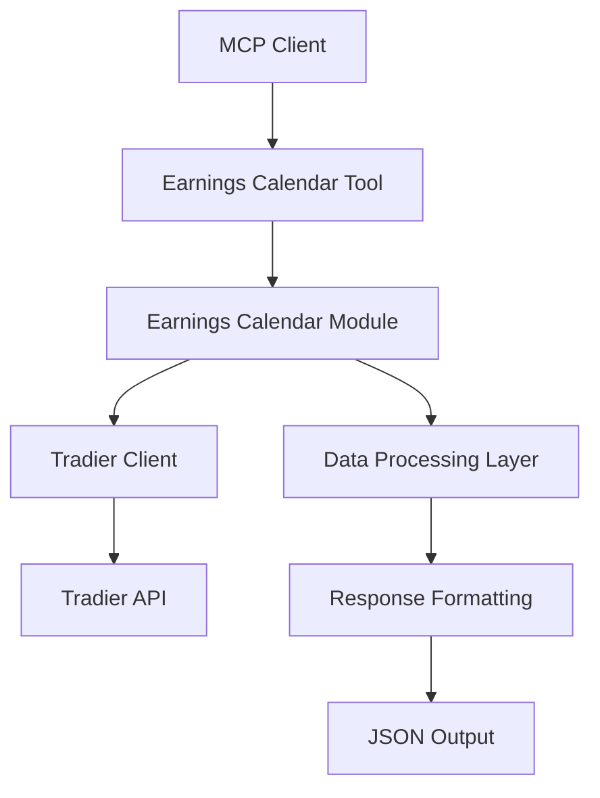

# PRD v3: Earnings Calendar MCP Server Tool - AI Enhanced Implementation Plan

## 🎯 Executive Summary

This PRD outlines the development of an Earnings Calendar MCP Server Tool for the TradingAgentMCP MCP server. The tool will provide comprehensive earnings calendar information for a given stock symbol using real-time data from the Tradier API, enabling traders and investors to track upcoming earnings announcements and historical earnings events.

## 📋 Problem Statement

Currently, the TradingAgentMCP MCP server lacks a dedicated tool for retrieving earnings calendar information. Traders and investors need access to:
- Upcoming earnings announcement dates
- Historical earnings events
- Comprehensive corporate calendar data
- Real-time, accurate earnings scheduling information

This information is crucial for making informed trading decisions, especially for options strategies and event-driven trading.

## 🎯 Objectives

### Primary Goals
1. **Earnings Calendar Retrieval**: Implement a robust MCP tool that fetches earnings calendar data for any stock symbol
2. **Real-time Data Integration**: Leverage Tradier API's corporate calendar endpoint for live, accurate data
3. **Comprehensive Information Display**: Provide both human-readable formatted output and structured data
4. **Error Handling**: Implement robust error handling for various edge cases

### Success Criteria
- ✅ Tool successfully retrieves earnings calendar data for valid stock symbols
- ✅ Returns structured JSON response with earnings events, dates, and metadata
- ✅ Handles edge cases gracefully (invalid symbols, no data available, API errors)
- ✅ Integrates seamlessly with existing MCP server architecture
- ✅ Maintains consistency with existing tool patterns in the codebase
- ✅ Passes comprehensive test coverage (>90%)

## 🏗️ Technical Architecture

### System Components



### Technology Stack
- **Backend**: Python 3.13+
- **Framework**: FastMCP 2.0+
- **Data Provider**: Tradier API
- **API Client**: Existing TradierClient
- **Data Validation**: Pydantic models
- **Testing**: Pytest with asyncio support

## 📁 Implementation Structure

### File Organization
```
src/
├── market/
│   ├── __init__.py
│   └── earnings_calendar.py          # New earnings calendar implementation
├── mcp_server/
│   ├── tools/
│   │   └── get_earnings_calendar_tool.py # New MCP tool wrapper
│   └── server.py                     # Updated with new tool registration
└── provider/tradier/
    └── client.py                     # Already has get_corporate_calendar method
```

## 🔧 Implementation Details

### Phase 1: Core Earnings Calendar Module (`src/market/earnings_calendar.py`)

#### Data Structures
```python
from dataclasses import dataclass
from typing import List, Optional, Dict, Any
from datetime import datetime

@dataclass
class EarningsEvent:
    """Earnings event data structure."""
    event: Optional[str]
    begin_date: Optional[str]
    end_date: Optional[str]
    event_type: Optional[int]
    fiscal_year: Optional[str]
    status: Optional[str]
    estimated_next_date: Optional[str]

@dataclass
class EarningsCalendarResponse:
    """Comprehensive earnings calendar response."""
    symbol: str
    provider: str
    request_type: str
    earnings_events: List[EarningsEvent]
    total_events: int
    next_earnings_date: Optional[str]
    message: Optional[str]
    error: Optional[str]
    details: Optional[str]
```

#### Core Function Implementation
```python
async def get_earnings_calendar(
    symbol: str,
    tradier_client: Optional[TradierClient] = None
) -> Dict[str, Any]:
    """
    Get corporate calendar information including earnings dates for a security.

    Args:
        symbol: Stock symbol to get earnings calendar for
        tradier_client: Tradier client instance (will create if None)

    Returns:
        Dictionary containing formatted earnings calendar information
    """
    # Implementation follows the reference pattern with enhancements:
    # 1. Improved error handling
    # 2. Better data validation
    # 3. Enhanced filtering for earnings-related events
    # 4. Comprehensive response structure
```

### Phase 2: MCP Tool Integration (`src/mcp_server/tools/get_earnings_calendar_tool.py`)

```python
from typing import Dict, Any
from ...market.earnings_calendar import get_earnings_calendar
from ...provider.tradier.client import TradierClient

async def get_earnings_calendar_tool(symbol: str) -> Dict[str, Any]:
    """
    MCP tool wrapper for earnings calendar functionality.

    Args:
        symbol: Stock ticker symbol (e.g., "TSLA", "AAPL", "NVDA")

    Returns:
        Comprehensive earnings calendar information
    """
    try:
        # Initialize Tradier client
        tradier_client = TradierClient()

        # Get earnings calendar data
        result = await get_earnings_calendar(symbol, tradier_client)
        return result

    except Exception as e:
        return {
            "error": f"Failed to fetch earnings calendar for {symbol}",
            "details": str(e),
            "symbol": symbol,
            "provider": "TRADIER"
        }
```

### Phase 3: Server Registration (`src/mcp_server/server.py`)

```python
# Add import
from .tools.get_earnings_calendar_tool import get_earnings_calendar_tool

# Add to create_server function
@mcp.tool()
async def earnings_calendar_tool(symbol: str) -> Dict[str, Any]:
    """
    Get comprehensive earnings calendar information for a stock symbol.

    Retrieves detailed earnings calendar data including upcoming and historical
    earnings events, announcement dates, and corporate calendar information
    using real-time Tradier API data.

    Args:
        symbol: Stock ticker symbol (e.g., "TSLA", "AAPL", "NVDA")

    Returns:
        Comprehensive earnings calendar information with formatted display and raw data
    """
    return await get_earnings_calendar_tool(symbol)
```

## 🎨 Data Processing Logic

### Earnings Event Filtering
The implementation will filter corporate calendar events to identify earnings-related activities:

```python
EARNINGS_KEYWORDS = [
    "earnings", "quarter", "fiscal year", "results",
    "quarterly", "annual", "report", "announcement"
]

def is_earnings_related(event_description: str) -> bool:
    """Check if an event is earnings-related."""
    return any(
        keyword in event_description.lower()
        for keyword in EARNINGS_KEYWORDS
    )
```

### Date Processing
- Sort events chronologically (newest first)
- Identify upcoming vs. historical events
- Calculate next earnings date if available
- Handle date format standardization

### Response Structure
```json
{
  "symbol": "AAPL",
  "provider": "TRADIER",
  "request_type": "Symbol",
  "earnings_events": [
    {
      "event": "Q1 2024 Earnings Call",
      "begin_date": "2024-01-25",
      "end_date": "2024-01-25",
      "event_type": 8,
      "fiscal_year": "2024",
      "status": "confirmed",
      "estimated_next_date": "2024-04-25"
    }
  ],
  "total_events": 4,
  "next_earnings_date": "2024-01-25",
  "message": null
}
```

## 🧪 Testing Strategy

### Test Categories

#### Unit Tests (`tests/market/test_earnings_calendar.py`)
```python
import pytest
from unittest.mock import Mock, AsyncMock
from src.market.earnings_calendar import get_earnings_calendar

class TestEarningsCalendar:
    @pytest.mark.asyncio
    async def test_successful_earnings_calendar_retrieval(self):
        """Test successful earnings calendar data retrieval."""
        # Mock Tradier client response
        # Test data parsing
        # Verify response structure

    @pytest.mark.asyncio
    async def test_no_earnings_data_available(self):
        """Test handling when no earnings data is available."""

    @pytest.mark.asyncio
    async def test_api_error_handling(self):
        """Test proper error handling for API failures."""

    @pytest.mark.asyncio
    async def test_invalid_symbol_handling(self):
        """Test handling of invalid stock symbols."""
```

#### Integration Tests (`tests/tools/test_earnings_calendar_tool.py`)
```python
class TestEarningsCalendarTool:
    @pytest.mark.asyncio
    async def test_mcp_tool_integration(self):
        """Test MCP tool wrapper functionality."""

    @pytest.mark.asyncio
    async def test_tool_error_responses(self):
        """Test tool error handling and response format."""
```

### Test Data
- Mock corporate calendar responses
- Edge case scenarios (empty data, malformed responses)
- Various earnings event types
- Date boundary conditions

## 🚀 Implementation Phases

### Phase 1: Core Module (Week 1)
- [ ] Create `src/market/earnings_calendar.py`
- [ ] Implement `get_earnings_calendar()` function
- [ ] Add comprehensive error handling
- [ ] Create unit tests
- [ ] Verify integration with existing TradierClient

### Phase 2: MCP Tool Integration (Week 1)
- [ ] Create `src/mcp_server/tools/get_earnings_calendar_tool.py`
- [ ] Implement MCP tool wrapper
- [ ] Register tool in server configuration
- [ ] Add integration tests
- [ ] Verify tool accessibility via MCP protocol

### Phase 3: Testing & Documentation (Week 2)
- [ ] Complete test coverage
- [ ] Performance testing with various symbols
- [ ] Error scenario testing
- [ ] Update documentation
- [ ] Code review and refinement

### Phase 4: Deployment & Validation (Week 2)
- [ ] Deploy to development environment
- [ ] Conduct user acceptance testing
- [ ] Performance monitoring
- [ ] Production deployment
- [ ] Monitor tool usage and errors

## 🛡️ Error Handling & Edge Cases

### Error Scenarios
1. **Invalid Stock Symbol**: Return structured error with helpful message
2. **API Rate Limiting**: Implement retry logic (already in TradierClient)
3. **No Calendar Data**: Return empty events array with informative message
4. **Network Failures**: Graceful degradation with error details
5. **Malformed API Response**: Robust parsing with fallback handling

### Error Response Format
```json
{
  "error": "Failed to fetch earnings calendar for INVALID",
  "details": "Symbol not found",
  "symbol": "INVALID",
  "provider": "TRADIER",
  "earnings_events": []
}
```

## 📊 Performance Considerations

### Optimization Strategies
- **Caching**: Consider implementing response caching for frequently requested symbols
- **Rate Limiting**: Respect Tradier API rate limits (handled by existing client)
- **Async Processing**: Maintain async/await pattern throughout
- **Response Size**: Filter and optimize response data for relevance

### Performance Targets
- Response time: < 2 seconds for typical requests
- Error handling: < 500ms for error responses
- Memory usage: Efficient data structures and cleanup
- API efficiency: Minimize unnecessary API calls

## 🔒 Security Considerations

### Data Security
- **API Key Protection**: Leverage existing .env configuration
- **Input Validation**: Sanitize stock symbol inputs
- **Error Information**: Avoid exposing sensitive API details in error messages
- **Access Control**: Maintain MCP protocol security standards

### Compliance
- Follow existing codebase security patterns
- Maintain audit trail for API usage
- Ensure data handling complies with financial data regulations

## 🚦 Quality Assurance

### Code Quality Standards
- **Type Hints**: Complete type annotation coverage
- **Documentation**: Comprehensive docstrings and comments
- **Error Handling**: Explicit exception handling
- **Code Style**: Follow existing project conventions
- **Test Coverage**: Minimum 90% code coverage

### Review Checklist
- [ ] Follows existing codebase patterns
- [ ] Comprehensive error handling
- [ ] Complete test coverage
- [ ] Type safety compliance
- [ ] Documentation completeness
- [ ] Performance optimization
- [ ] Security considerations addressed

## 📈 Future Enhancements

### Version 3.1 Potential Features
- **Multi-Symbol Queries**: Batch processing for multiple symbols
- **Date Range Filtering**: Filter events by date ranges
- **Event Type Filtering**: Filter by specific event types
- **Calendar Integration**: Export to calendar formats
- **Notification System**: Alert system for upcoming earnings

### Version 3.2 Advanced Features
- **Historical Analysis**: Earnings impact analysis
- **Prediction Models**: AI-enhanced earnings date prediction
- **Market Impact**: Integration with price movement analysis
- **Sector Analysis**: Industry-wide earnings calendar views

## 📝 Conclusion

The Earnings Calendar MCP Server Tool will significantly enhance the TradingAgentMCP server's capabilities by providing comprehensive earnings calendar information. The implementation follows established patterns in the codebase while introducing robust new functionality that supports various trading and investment strategies.

The modular design ensures maintainability and extensibility, while comprehensive testing guarantees reliability. The integration with the existing Tradier API infrastructure provides a solid foundation for real-time, accurate earnings data.

This enhancement positions the TradingAgentMCP server as a more complete solution for financial data analysis and trading support, with clear paths for future feature expansion and optimization.

---

**Implementation Timeline**: 2 weeks
**Primary Developer**: TBD
**Review Required**: Senior Developer + QA
**Deployment Target**: Development → Staging → Production
