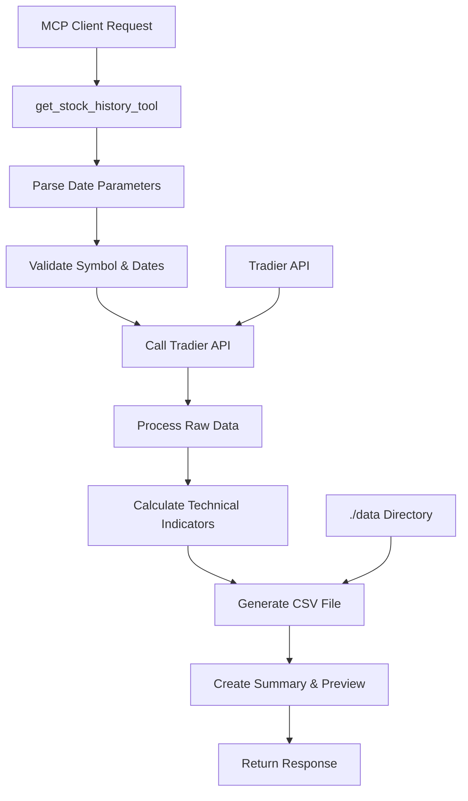

# Stock History Data MCP Server Tool - AI Enhanced PRD v4

## 1. 概览与目标

### 1.1 产品目标
创建一个全面的股票历史数据 MCP 服务器工具，能够根据股票代码和日期范围检索历史价格数据，并将数据保存为 CSV 文件供进一步分析。

### 1.2 核心价值主张
- **灵活的日期范围支持**: 支持绝对日期 (YYYY-MM-DD) 和相对日期格式 ("30d", "3m")
- **数据持久化**: 自动保存 CSV 文件到本地存储
- **上下文优化**: 仅返回关键摘要和前30条记录，避免占用过多上下文
- **实时数据**: 基于 Tradier API 获取真实、非模拟的市场数据
- **技术指标增强**: 包含移动平均线、ATR、布林带等技术分析指标

## 2. 功能需求规格

### 2.1 核心功能
- **历史数据检索**: 支持股票日K线、周K线、月K线数据获取
- **灵活日期范围**: 
  - 绝对日期: `start_date="2023-01-01", end_date="2023-12-31"`
  - 相对日期: `date_range="30d"` (过去30天), `date_range="6m"` (过去6个月)
  - 混合模式: `start_date="2023-01-01", date_range="3m"` (从指定日期开始的3个月)
- **CSV 文件生成**: 自动保存到 `./data` 目录，文件名格式化
- **技术指标计算**: SMA20、ATR14、布林带、历史波动率
- **数据摘要**: 返回价格统计、成交量分析、技术指标概览

### 2.2 输入参数
```python
async def get_stock_history_tool(
    symbol: str,                          # 必需: 股票代码 (e.g., "AAPL", "TSLA")
    start_date: Optional[str] = None,     # 可选: 开始日期 YYYY-MM-DD
    end_date: Optional[str] = None,       # 可选: 结束日期 YYYY-MM-DD  
    date_range: Optional[str] = None,     # 可选: 相对日期范围 ("30d", "3m", "1y")
    interval: str = "daily",              # 可选: 数据间隔 (daily, weekly, monthly)
    include_indicators: bool = True       # 可选: 是否包含技术指标
) -> Dict[str, Any]
```

### 2.3 输出格式
```json
{
  "status": "success",
  "symbol": "AAPL",
  "data_file": "./data/AAPL_2023-01-01_2023-12-31_1234567890.csv",
  "summary": {
    "total_records": 252,
    "date_range": {
      "start": "2023-01-01",
      "end": "2023-12-31"
    },
    "price_summary": {
      "open_first": 130.50,
      "close_last": 185.25,
      "high_max": 198.75,
      "low_min": 125.80,
      "total_return": 41.92,
      "total_return_pct": 32.13
    },
    "volume_summary": {
      "average_volume": 58420000,
      "total_volume": 14729040000,
      "max_volume": 126380000,
      "min_volume": 35420000
    },
    "technical_indicators": {
      "current_sma_20": 182.45,
      "current_ema_12": 184.32,
      "current_ema_26": 178.91,
      "current_atr_14": 3.87,
      "current_rsi_14": 67.23,
      "bollinger_upper": 195.23,
      "bollinger_lower": 169.67,
      "current_volatility": 0.2845,
      "macd": {
        "macd_line": 5.41,
        "signal_line": 4.28,
        "histogram": 1.13
      }
    }
  },
  "preview_records": [
    {
      "date": "2023-12-31",
      "open": 184.12,
      "high": 186.95,
      "low": 182.47,
      "close": 185.25,
      "volume": 42830000,
      "sma_20": 182.45,
      "ema_12": 184.32,
      "ema_26": 178.91,
      "atr_14": 3.87,
      "rsi_14": 67.23,
      "upper_bollinger": 195.23,
      "lower_bollinger": 169.67,
      "volatility": 0.2845,
      "macd": 5.41,
      "macd_signal": 4.28,
      "macd_histogram": 1.13
    }
    // ... up to 30 most recent records
  ]
}
```

## 3. 技术架构

### 3.1 模块设计
```
src/
├── stock/
│   ├── __init__.py
│   └── history_data.py          # 新增: 历史数据核心模块
├── mcp_server/
│   └── tools/
│       └── get_stock_history_tool.py  # 新增: MCP 工具包装器
└── data/                        # 新增: CSV 数据存储目录
    └── .gitkeep
```

### 3.2 数据流架构


### 3.3 依赖关系
- **现有依赖**: `src/provider/tradier/client.py` (TradierClient)
- **新增依赖**: `pandas`, `numpy` (技术指标计算)
- **文件系统**: 创建 `./data` 目录用于 CSV 存储

## 4. 实现计划

### 4.1 阶段 1: 核心历史数据模块
**文件**: `src/stock/history_data.py`

**核心功能**:
- 日期范围解析器 (支持绝对和相对格式)
- Tradier API 集成
- 数据验证和清理
- 技术指标计算引擎

**关键函数**:
```python
def parse_date_range(start_date, end_date, date_range) -> Tuple[str, str]:
    """解析各种日期格式，返回标准化的开始和结束日期"""

async def get_stock_history_data(
    symbol: str, 
    start_date: str, 
    end_date: str, 
    interval: str = "daily"
) -> Dict[str, Any]:
    """从 Tradier API 获取历史数据并计算技术指标"""

def calculate_technical_indicators(df: pd.DataFrame) -> pd.DataFrame:
    """计算技术指标: SMA20, ATR14, 布林带, 波动率"""

def generate_csv_filename(symbol: str, start_date: str, end_date: str) -> str:
    """生成标准化的 CSV 文件名"""

def save_to_csv(data: pd.DataFrame, filepath: str) -> str:
    """保存数据到 CSV 文件"""
```

### 4.2 阶段 2: MCP 工具包装器
**文件**: `src/mcp_server/tools/get_stock_history_tool.py`

**功能**:
- 参数验证和标准化
- 调用核心历史数据模块
- 错误处理和用户友好的错误消息
- 响应格式化

**工具签名**:
```python
@mcp.tool()
async def stock_history_tool(
    symbol: str,
    start_date: Optional[str] = None,
    end_date: Optional[str] = None,
    date_range: Optional[str] = None,
    interval: str = "daily",
    include_indicators: bool = True
) -> Dict[str, Any]:
    """获取股票历史数据并保存为 CSV 文件"""
```

### 4.3 阶段 3: 服务器集成
**文件**: `src/mcp_server/server.py`

**更新**:
- 导入新的历史数据工具
- 注册工具到 MCP 服务器
- 更新服务器元数据

### 4.4 阶段 4: 测试套件
**文件**: 
- `tests/stock/test_history_data.py` (单元测试)
- `tests/tools/test_get_stock_history_tool.py` (集成测试)

**测试覆盖**:
- 日期解析逻辑 (各种格式组合)
- Tradier API 集成 (mock 响应)
- 技术指标计算准确性
- CSV 文件生成和格式
- 错误场景处理

## 5. 日期范围解析逻辑

### 5.1 支持的格式
```python
# 绝对日期范围
start_date="2023-01-01", end_date="2023-12-31"

# 相对日期范围
date_range="30d"    # 过去30天
date_range="3m"     # 过去3个月  
date_range="1y"     # 过去1年

# 混合模式
start_date="2023-01-01", date_range="6m"  # 从2023-01-01开始的6个月
end_date="2023-12-31", date_range="3m"    # 截止到2023-12-31的前3个月
```

### 5.2 解析优先级
1. **start_date + end_date**: 使用指定的绝对日期范围
2. **start_date + date_range**: 从start_date开始，向后推进date_range
3. **end_date + date_range**: 截止到end_date，向前回溯date_range  
4. **仅 date_range**: 从当前日期向前回溯date_range
5. **无参数**: 默认过去90天

### 5.3 日期验证规则
- 开始日期不能晚于结束日期
- 日期不能超过当前日期
- 相对日期范围限制: 最大5年 (`5y`)
- 工作日调整: 自动跳过周末到最近的交易日

## 6. CSV 文件管理

### 6.1 文件命名规范
```
格式: {symbol}_{start_date}_{end_date}_{timestamp}.csv
示例: AAPL_2023-01-01_2023-12-31_1703980800.csv
```

### 6.2 文件结构
```csv
Date,Open,High,Low,Close,Volume,SMA_20,EMA_12,EMA_26,ATR_14,RSI_14,Upper_Bollinger,Lower_Bollinger,Volatility,MACD,MACD_Signal,MACD_Histogram
2023-01-01,130.50,132.75,129.80,132.10,65430000,,,,,,,,,,,
2023-01-02,132.20,134.50,131.90,133.85,58920000,,,,,,,,,,,
...
```

### 6.3 存储策略
- **目录**: `./data/` (项目根目录下)
- **保留策略**: 保留所有历史文件，用户手动清理
- **文件大小**: 预估每年数据约 50KB (252个交易日)
- **权限**: 确保目录可写，文件可读

## 7. 技术指标计算

### 7.1 支持的指标

#### 基础指标
- **SMA 20**: 20日简单移动平均线
- **EMA 12/26**: 12日和26日指数移动平均线
- **ATR 14**: 14日平均真实波动范围
- **布林带**: 20日布林带 (2个标准差)
- **历史波动率**: 20日年化波动率

#### 动量指标
- **RSI 14**: 14日相对强弱指数 (0-100 范围)
- **MACD**: 移动平均收敛散度指标
  - MACD 线 (EMA12 - EMA26)
  - 信号线 (MACD的9日EMA)
  - MACD 柱状图 (MACD - 信号线)

### 7.2 计算实现
使用 pandas rolling 函数和数学公式实现高效计算:

#### 基础指标计算
```python
# SMA 20
df['sma_20'] = df['close'].rolling(window=20).mean()

# EMA 12 和 26
df['ema_12'] = df['close'].ewm(span=12).mean()
df['ema_26'] = df['close'].ewm(span=26).mean()

# ATR 14  
df['true_range'] = np.maximum(
    df['high'] - df['low'],
    np.maximum(
        abs(df['high'] - df['close'].shift(1)),
        abs(df['low'] - df['close'].shift(1))
    )
)
df['atr_14'] = df['true_range'].rolling(window=14).mean()

# 布林带
std_20 = df['close'].rolling(window=20).std()
sma_20 = df['close'].rolling(window=20).mean()
df['upper_bollinger'] = sma_20 + (2 * std_20)
df['lower_bollinger'] = sma_20 - (2 * std_20)

# 历史波动率 (年化)
df['returns'] = df['close'].pct_change()
df['volatility'] = df['returns'].rolling(window=20).std() * np.sqrt(252)
```

#### 动量指标计算
```python
# RSI 14
def calculate_rsi(prices, window=14):
    delta = prices.diff()
    gain = (delta.where(delta > 0, 0)).rolling(window=window).mean()
    loss = (-delta.where(delta < 0, 0)).rolling(window=window).mean()
    rs = gain / loss
    return 100 - (100 / (1 + rs))

df['rsi_14'] = calculate_rsi(df['close'], 14)

# MACD
df['macd'] = df['ema_12'] - df['ema_26']
df['macd_signal'] = df['macd'].ewm(span=9).mean()
df['macd_histogram'] = df['macd'] - df['macd_signal']
```

## 8. 错误处理策略

### 8.1 输入验证错误
- **无效股票代码**: 返回友好错误消息和建议
- **日期格式错误**: 提供正确格式示例
- **日期逻辑错误**: 具体说明冲突原因

### 8.2 API 错误处理
- **网络超时**: 实现指数退避重试 (最多3次)
- **API 限流**: 提供重试建议和时间估计
- **数据不可用**: 说明可能原因 (停牌、退市等)

### 8.3 文件系统错误
- **目录不存在**: 自动创建 `./data` 目录
- **权限不足**: 提供权限修复建议
- **磁盘空间不足**: 提前检查可用空间

## 9. 性能考虑

### 9.1 数据量估算
- **日数据**: 1年 ≈ 252条记录 ≈ 50KB CSV
- **技术指标**: 增加约20%文件大小
- **内存使用**: 处理过程中约 1-2MB (1年数据)

### 9.2 优化策略
- **分批处理**: 大于2年数据时分批API调用
- **缓存机制**: 考虑实现本地缓存避免重复API调用
- **异步处理**: 使用 asyncio 提高并发性能

## 10. 集成测试场景

### 10.1 功能测试用例
1. **基本功能**: 获取 AAPL 过去30天数据
2. **日期解析**: 测试所有支持的日期格式组合
3. **技术指标**: 验证计算结果准确性
4. **CSV 生成**: 检查文件格式和内容完整性
5. **错误处理**: 模拟各种错误场景

### 10.2 端到端测试
```python
# 测试完整工作流程
response = await stock_history_tool(
    symbol="TSLA",
    date_range="3m",
    include_indicators=True
)

assert response["status"] == "success"
assert os.path.exists(response["data_file"])
assert len(response["preview_records"]) <= 30
assert "technical_indicators" in response["summary"]
```

## 11. 部署和配置

### 11.1 环境配置
确保 `.env` 文件包含:
```env
TRADIER_ACCESS_TOKEN=your_token_here
TRADIER_ENVIRONMENT=sandbox  # or production
```

### 11.2 目录初始化
```bash
# 创建数据存储目录
mkdir -p ./data
echo "# CSV data files stored here" > ./data/.gitkeep
```

### 11.3 依赖更新
更新 `pyproject.toml`:
```toml
[dependencies]
pandas = "^2.0.0"
numpy = "^1.24.0"
# ... 其他现有依赖
```

## 12. 未来扩展考虑

### 12.1 v4.1 计划功能
- **分钟级数据**: 支持 1min, 5min, 15min 间隔
- **多股票批量**: 一次请求处理多个股票
- **数据导出格式**: 支持 JSON, Parquet 格式

### 12.2 v4.2 计划功能  
- **更多技术指标**: KDJ, 威廉指标, 成交量指标 等
- **数据可视化**: 生成价格图表和技术指标图
- **数据同步**: 增量更新已有数据文件
- **指标信号**: 买卖信号生成和回测功能

### 12.3 性能优化
- **数据缓存**: Redis/内存缓存热门股票数据
- **并行处理**: 多股票并行API调用
- **数据压缩**: 压缩存储历史数据文件

## 13. 成功标准

### 13.1 功能标准
- ✅ 支持所有计划的日期格式
- ✅ 成功集成 Tradier API
- ✅ 正确计算技术指标
- ✅ 生成格式正确的 CSV 文件
- ✅ 返回结构化的摘要数据

### 13.2 性能标准
- ✅ API 响应时间 < 5秒 (1年数据)
- ✅ 内存使用 < 10MB (处理过程中)
- ✅ 测试覆盖率 > 85%

### 13.3 可用性标准
- ✅ 用户友好的错误消息
- ✅ 完整的类型提示
- ✅ 清晰的文档和示例

---

## 总结

此 PRD 详细规划了股票历史数据 MCP 工具的实现，重点关注:

1. **灵活性**: 支持多种日期格式和数据间隔
2. **实用性**: 保存 CSV 文件供后续分析使用  
3. **效率性**: 仅返回关键摘要避免上下文溢出
4. **可扩展性**: 模块化设计便于未来功能扩展
5. **可靠性**: 全面的错误处理和测试覆盖

该实现将为 TradingAgentMCP 服务器提供强大的历史数据分析能力。